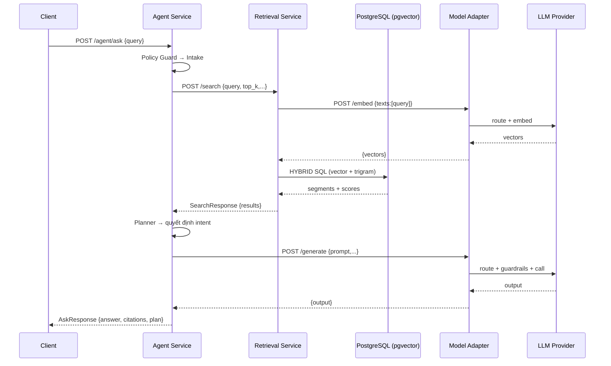

# Kiến trúc Intelligent-Overlay

## Tổng quan hệ thống

- Monorepo `ai-core` gom toàn bộ dịch vụ phục vụ chuỗi xử lý cao cấp cho sản phẩm Intelligent Overlay, xây dựng trên Python 3.11.
- Kiến trúc microservice tách biệt nhiệm vụ: quản lý prompt, truy hồi tri thức, chuẩn hóa truy cập mô hình, điều phối tác vụ phân tích và tác nhân hội thoại.
- Mỗi dịch vụ cung cấp REST API qua FastAPI, kèm endpoint `/metrics` cho Prometheus và `/healthz` cho kiểm tra tình trạng.
- Các thành phần chính giao tiếp qua HTTP nội bộ, Kafka và Ray; dữ liệu lâu dài lưu trên PostgreSQL, cache tại Redis, và lưu trữ nhị phân trên MinIO (S3 tương thích).

## Các dịch vụ lõi

### Model Adapter

- Vị trí: `ai-core/services/model-adapter`.
- Chức năng: trừu tượng hóa gọi LLM/embedding, áp dụng guardrails (PII masking, policy, system prompt), chọn nhà cung cấp theo chính sách routing.
- Endpoint chính: `POST /generate`, `POST /embed`, `GET /providers`.
- Tích hợp provider qua `providers/` (OpenAI, Anthropic, Mistral, Ollama) và điều phối bằng `routing/policy.py`.
- Phụ thuộc: Redis (cache metadata), MinIO (lưu model artefacts nếu cần), thông số truy vết qua `shared/telemetry/*`.

### Prompt Service

- Vị trí: `ai-core/services/prompt-service`.
- Chức năng: quản lý vòng đời prompt/template, lưu versioning, định nghĩa schema đầu vào/ra, cung cấp API đọc/ghi kèm caching Redis.
- Endpoint chính: `POST /prompts`, `POST /prompts/{id}/versions`, `GET /prompts/{id}` với tham số `version`.
- Sử dụng Alembic/PostgreSQL cho lưu trữ, chuẩn hóa template qua `domain.validators`.

### Retrieval Service

- Vị trí: `ai-core/services/retrieval-service`.
- Chức năng: ingest tài liệu, xây dựng kho embedding (pgvector) và tìm kiếm lai (vector + trigram).
- Endpoint chính: `POST /ingest`, `POST /search`.
- Luồng search gọi `model-adapter` để làm embedding truy vấn, sau đó thực thi truy vấn SQL lai (HYBRID) và tính highlight.
- Storage: PostgreSQL với extension pgvector; kết nối qua SQLAlchemy async.

### Agent Service

- Vị trí: `ai-core/services/agent-service`.
- Chức năng: triển khai tác nhân LangGraph gồm các nút policy guard, intake, retrieval, planner, tool call và fallback để trả lời câu hỏi người dùng.
- Endpoint chính: `POST /agent/ask`.
- Gọi `retrieval-service` để lấy ngữ cảnh, `model-adapter` để sinh phản hồi hoặc gọi tool theo kế hoạch, theo dõi fallback/tool error bằng Prometheus counter.
- Định nghĩa state dùng Pydantic (`domain/state.py`), đồ thị trạng thái cấu hình tại `graph/build.py`.

### Orchestrator

- Vị trí: `ai-core/services/orchestrator`.
- Chức năng: xử lý hàng loạt tác vụ phân tích (summary, argument, sentiment, logic bias). Tiêu thụ Kafka topic, phân tán công việc qua Ray, tổng hợp kết quả, quản lý idempotency và dead-letter queue.
- Tích hợp với repository Postgres để lưu `analysis_runs` và `llm_calls`.
- Worker Ray định nghĩa trong `workers/*`, aggregator tổng hợp trạng thái tại `orchestration/aggregator.py`.

## Luồng tương tác chính

- **Hỏi đáp tức thời**: Client → `agent-service` → guard/policy → `retrieval-service` (hybrid search) → planner quyết định dùng tool hay trả lời trực tiếp → `model-adapter` (LLM) → Agent trả lời, ghi log + metric.
- **Ingest & tìm kiếm nội dung**: Nguồn dữ liệu → `retrieval-service` (ingest) → lưu segment + embedding → `agent-service` hoặc client khác gọi `POST /search` để lấy kết quả kèm highlight.
- **Quản lý prompt**: Ops/API → `prompt-service` để tạo phiên bản mới → cache Redis → `agent-service` hoặc `model-adapter` tiêu thụ template qua API/kho dữ liệu.
- **Phân tích hàng loạt**: Hệ thống upstream phát sự kiện Kafka → `orchestrator` đọc, dùng Ray fan-out tới worker (gọi `model-adapter` nếu cần) → aggregate lưu Postgres → nếu thất bại gửi DLQ.
- **Quan sát & giám sát**: Mọi dịch vụ xuất số liệu tại `/metrics`, trace qua OpenTelemetry khi có `OTLP_ENDPOINT`, log JSON chuẩn cho Loki/Promtail.

```text
Client
  │
  ▼
Agent Service ──► Retrieval Service ──► PostgreSQL (pgvector)
  │                                ▲
  └────► Model Adapter ────────────┘
                 │
                 ▼
          Nhà cung cấp LLM
```

## Sơ đồ luồng kết nối

```mermaid
flowchart LR
  subgraph Client["Client/Apps"]
    UI[UI / API Client]
  end

  subgraph Agent["Agent Service (FastAPI + LangGraph)"]
    A1[Policy Guard]
    A2[Intake]
    A3[Retrieval Node]
    A4[Planner]
    A5[Tool Call]
    A6[Answer/Fallback]
  end

  subgraph Retrieval["Retrieval Service (FastAPI)"]
    R1[POST /search]
    DB[(PostgreSQL + pgvector)]
  end

  subgraph Adapter["Model Adapter (FastAPI)"]
    M1[POST /generate]
    M2[POST /embed]
    P["Guardrails + Routing Policy"]
    LLM[(Nhà cung cấp LLM)]
  end

  subgraph Prompt["Prompt Service (FastAPI)"]
    PR1[CRUD Prompt/Version]
    RED[(Redis Cache)]
  end

  subgraph Orchestrator["Orchestrator (FastAPI + Kafka + Ray)"]
    O1[Kafka Consumer]
    O2[Fan-out Workers (Ray)]
    O3[Aggregator]
    DLQ[(DLQ Producer)]
    ORDB[(PostgreSQL)]
  end

  subgraph Infra["Hạ tầng"]
    S3[(MinIO/S3)]
    METRICS[(Prometheus /metrics)]
    OTEL[(OpenTelemetry)]
  end

  %% Client -> Agent
  UI -->|/agent/ask| A1 --> A2 --> A3 --> A4 --> A5 --> A6

  %% Agent <-> Retrieval
  A3 -->|/search (hybrid)| R1 --> DB

  %% Agent/Workers <-> Model Adapter
  A5 -->|/generate| M1 --> P --> LLM
  R1 -. embedding .-> M2
  O2 -. may call .-> M1

  %% Prompt Service
  UI -->|manage prompts| PR1
  PR1 <--> RED

  %% Orchestrator
  UI -->|publish event| O1 --> O2 --> O3 --> ORDB
  O3 -->|on fail| DLQ

  %% Observability
  Agent --- METRICS
  Retrieval --- METRICS
  Adapter --- METRICS
  Prompt --- METRICS
  Orchestrator --- METRICS
  Agent --- OTEL
  Retrieval --- OTEL
  Adapter --- OTEL
  Prompt --- OTEL
  Orchestrator --- OTEL

  %% Artefacts
  Adapter --- S3
```

### Chuỗi Q&A chi tiết (trình tự)



## Dữ liệu, hạ tầng & tích hợp

- **PostgreSQL**: Cơ sở dữ liệu chính cho prompt, retrieval và orchestrator; migration quản lý qua các thư mục `data/migrations` từng service và gốc `ai-core/db`.
- **Redis**: Cache prompt, lưu trạng thái nhanh cho agent và orchestrator.
- **MinIO/S3**: Lưu trữ đối tượng phục vụ adapter (ví dụ model checkpoint, tệp trung gian).
- **Ray Cluster**: Khởi chạy từ Docker Compose (`ray-head`, `ray-worker`) cung cấp tài nguyên tính toán phân tán cho orchestrator và agent.
- **Kafka**: Được truy cập qua `orchestrator/kafka/*` cho luồng sự kiện phân tích; cấu hình endpoint qua biến môi trường.
- **Docker Compose**: File `docker-compose.yaml` dựng toàn bộ stack local (Postgres, Redis, MinIO, Ray, các service).
- **Helm Chart**: `charts/aicore-app` chứa manifest triển khai Kubernetes (Deployment, Service, HPA, Ingress, ServiceMonitor).
- **ArgoCD / GitOps**: Thư mục `deploy/apps/app-of-apps.yaml` cấu hình App-of-Apps và giá trị riêng cho môi trường (`deploy/values/staging/*.yaml`).

## Thư viện dùng chung

- `shared/telemetry`: cung cấp logger JSON, metrics registry, và tích hợp OpenTelemetry thống nhất.
- `libs/common-schemas`: nơi đặt model/dataclass được tái sử dụng giữa các service.
- `libs/tracing`: tiện ích tracing nội bộ (điều chỉnh trong tương lai).
- `ai-core/db`: cấu trúc chung cho migration liên service.

## Bảo mật & kiểm soát chất lượng

- Guardrails trước khi gọi LLM (mask PII, áp chính sách) thông qua pipeline trong `model-adapter/guardrails`.
- Agent policy guard kiểm tra guard flag trước khi tiếp tục đồ thị xử lý.
- Orchestrator áp dụng idempotency và đẩy thông điệp vào DLQ khi fan-in thất bại.
- Tests unit/functional sẵn có trong mỗi service: ví dụ `agent-service/tests/test_flow_basic.py`, `retrieval-service/tests/test_search_hybrid.py`.

## Định hướng vận hành

- Healthcheck chuẩn `/healthz` cho mỗi service, thuận tiện tích hợp load balancer và readiness probe.
- Metric Prometheus hỗ trợ quan sát latency, lỗi tool, cache hit/miss, worker timeout.
- Để mở trace, đặt `SERVICE_NAME` và `OTLP_ENDPOINT`, bật logger JSON để gửi tới Loki.
- Pipeline CI/CD nên chạy `alembic upgrade head` cho từng service trước khi triển khai; Helm chart hỗ trợ cấu hình thông số tài nguyên và autoscaling.
